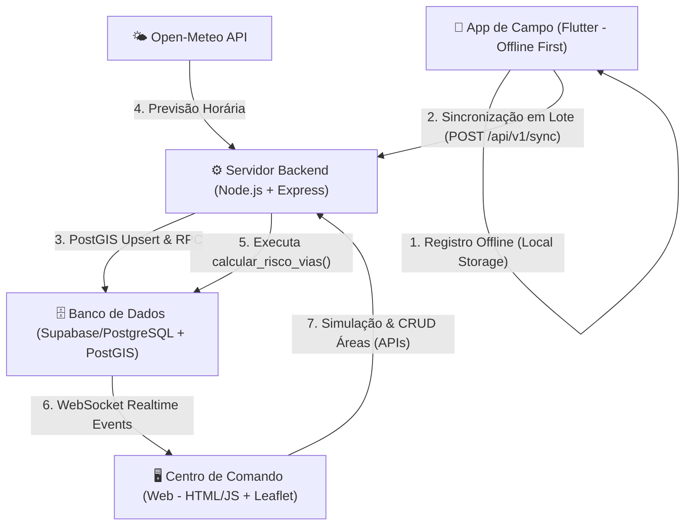

# 🚜🌧️ TrafegoAlert — Plataforma Preditiva de Trafegabilidade (Ariquemes/RO)

Este documento apresenta uma análise detalhada da arquitetura, do modelo de dados e de todas as funcionalidades desenvolvidas para o **TrafegoAlert**, uma plataforma inteligente projetada para mitigar o isolamento de produtores rurais e otimizar o escoamento agrícola no município de Ariquemes/RO durante o inverno amazônico.

---

## 🏗️ 1. Arquitetura de Software Geral

O sistema é dividido em três camadas principais estruturadas para garantir o funcionamento em áreas sem conectividade (comum na zona rural de Rondônia) e atualização instantânea dos centros de decisão urbana:



1. **Aplicativo Móvel (Flutter)**: Executado pelos motoristas e cidadãos no campo. Coleta geolocalização e envia relatórios em modo *Offline-First*.
2. **Servidor Backend (Node.js & Express)**: Gerencia o fluxo de sincronização de dados offline, calcula e orquestra a engine preditiva climática e expõe APIs para o Centro de Comando Web.
3. **Banco de Dados & BaaS (Supabase/PostgreSQL + PostGIS)**: Armazena geometrias espaciais (`LineString`, `Point`, `Polygon`), executa cálculos de proximidade geográfica e distribui atualizações via WebSockets em tempo real.
4. **Painel Web (Centro de Comando)**: Dashboard utilizado pela Secretaria de Infraestrutura/Obras para planejar manutenções e monitorar as estradas em tempo real.

---

## 🗄️ 2. Camada de Banco de Dados (Supabase / PostgreSQL / PostGIS)

O banco de dados utiliza o **PostgreSQL** com a extensão **PostGIS** ativada para realizar operações geoespaciais em tempo real no sistema de coordenadas **SRID 4326** (WGS 84).

### 2.1. Tabelas e Esquema de Dados

#### A. Tabela: `perfis`
Armazena as informações adicionais dos usuários autenticados no Supabase Auth, incluindo a associação de motoristas aos seus respectivos veículos.
* **id**: `UUID` (Chave Primária, referenciando `auth.users.id` com deleção em cascata).
* **nome**: `TEXT` (Nome de exibição do usuário).
* **funcao**: `TEXT` (Função/cargo com restrição: `motorista`, `produtor`, `administrador`, `secretaria_obras`, `cidadao`).
* **veiculo_tipo**: `TEXT` (Tipo de veículo principal do usuário, ex: caminhão, moto, caminhonete).
* **veiculo_placa**: `TEXT` (Placa do veículo para identificação e controle).
* **veiculo_descricao**: `TEXT` (Detalhes adicionais sobre o veículo).
* **created_at**: `TIMESTAMP WITH TIME ZONE` (Data de criação).

#### B. Tabela: `linhas_rurais`
Armazena a malha viária de estradas vicinais rurais (as "Linhas" de Ariquemes) com suas respectivas coordenadas geográficas.
* **id**: `BIGINT` (Chave Primária autoincrementável).
* **nome**: `TEXT` (Nome da estrada, ex: "Linha C-65", "Travessão B-40").
* **status_trafego**: `TEXT` (Status atual: `livre` 🟢, `atencao` 🟡, `bloqueado` 🔴).
* **indice_risco**: `NUMERIC(4,2)` (Índice de risco calculado de `0.00` a `10.00`).
* **geom**: `GEOMETRY(LineString, 4326)` (Geometria espacial da estrada).
* **tipo_via**: `TEXT` (Ex: Vicinal, Estadual, Federal).
* **jurisdicao**: `TEXT` (Ex: Municipal, Estadual).
* **pavimentada**: `BOOLEAN` (Indica se a estrada possui asfalto ou é de terra).
* **veiculos_principais**: `TEXT[]` (Tipos de veículos que transitam na via, ex: `['onibus_escolar', 'caminhao_graos']`).
* **pluviometria_simulada**: `NUMERIC(4,1)` (Volume de chuva local atribuído manualmente ou via simulador).
* **fonte**: `TEXT` (Fonte do mapeamento, ex: `CENSIPAM_WFS_2019`).
* **ano_base**: `INTEGER` (Ano de coleta do dado geográfico).
* **created_at** / **updated_at**: `TIMESTAMP WITH TIME ZONE`.

#### C. Tabela: `reportes_incidentes`
Registros de pontos críticos reportados diretamente do campo.
* **id**: `UUID` (Chave Primária gerada automaticamente).
* **usuario_id**: `UUID` (Referência ao perfil do usuário criador).
* **tipo_problema**: `TEXT` (Classificação do incidente: `atolamento`, `erosao`, `bueiro_danificado`, `ponte_caida`, `alagamento`, `buraco_severo`, `queda_arvore`, `deslizamento`, `animal_na_pista`, `obra_em_andamento`).
* **descricao**: `TEXT` (Relato descritivo detalhado).
* **latitude** / **longitude**: `NUMERIC` (Coordenadas geográficas decimais).
* **geom**: `GEOMETRY(Point, 4326)` (Ponto geográfico calculado automaticamente via gatilho).
* **foto_url**: `TEXT` (URL da foto anexada ao incidente).
* **resolvido**: `BOOLEAN` (Status de resolução do problema).
* **data_criacao_dispositivo**: `TIMESTAMP WITH TIME ZONE` (Data original do registro offline no dispositivo móvel).
* **created_at**: `TIMESTAMP WITH TIME ZONE` (Data de inserção no banco).

#### D. Tabela: `areas_monitoradas`
Áreas desenhadas de forma personalizada no mapa por administradores para monitoramento intensivo.
* **id**: `UUID` (Chave Primária).
* **usuario_id**: `UUID` (Criador da área).
* **nome**: `TEXT` (Ex: "Área de Risco C-65 Sul").
* **descricao**: `TEXT`.
* **status_situacao**: `TEXT` (Gravidade da área: `normal` 🟢, `atencao` 🟡, `critico` 🔴, `interditado` ⛔).
* **geom**: `GEOMETRY(Polygon, 4326)` (Polígono geográfico delimitador).
* **created_at** / **updated_at**: `TIMESTAMP WITH TIME ZONE`.

#### E. Tabela: `historico_rotas`
Rastros de trajetos percorridos e gravados pelos usuários para análise de trafegabilidade real.
* **id**: `UUID` (Chave Primária).
* **usuario_id**: `UUID` (Motorista associado).
* **geom**: `GEOMETRY(LineString, 4326)` (Caminho percorrido).
* **data_inicio** / **data_fim**: `TIMESTAMP WITH TIME ZONE` (Duração da rota).
* **created_at**: `TIMESTAMP WITH TIME ZONE`.

### 2.2. Triggers e Procedures SQL (Lógica de Banco)

#### A. Trigger `on_auth_user_created`
Sempre que um usuário se cadastra no Supabase Auth, dispara a função `handle_new_user()` que replica os metadados cadastrais (`nome`, `funcao`, e atributos de veículo) para a tabela `perfis`.

#### B. Trigger `tr_set_reportes_incidentes_geom`
Antes de inserir ou atualizar coordenadas de um incidente (`latitude` e `longitude`), a função `set_reportes_incidentes_geom()` é acionada para gerar a coluna PostGIS `geom` automaticamente a partir dos valores decimais:
```sql
NEW.geom := ST_SetSRID(ST_MakePoint(NEW.longitude, NEW.latitude), 4326);
```

#### C. Stored Procedure: `calcular_risco_vias(chuva_mm NUMERIC)`
O coração preditivo do banco de dados. Quando executado, recalcula dinamicamente a vulnerabilidade de todas as estradas baseando-se em:
1. **Precipitação**: Utiliza o valor de chuva simulado individualmente na via (`pluviometria_simulada`), ou, se for zero, o valor geral da chuva prevista (`chuva_mm`).
2. **Proximidade de Incidentes**: Conta a quantidade de incidentes ativos (não resolvidos) localizados a um raio de aproximadamente 150 metros da estrada rural (`ST_DWithin(lr.geom, ri.geom, 0.0015)`).
3. **Multiplicadores de Tráfego**: Dependendo do perfil de veículos que transitam na via (`veiculos_principais`), o risco é amplificado:
   * Ônibus Escolar (`onibus_escolar`): Multiplicador de **1.3x** (Risco social elevado).
   * Caminhão de Carga (`caminhao_madeira` / `caminhao_graos`): Multiplicador de **1.2x** (Risco de atolamento por peso).
   * Pedestre (`pedestre`): Multiplicador de **1.1x**.
   * Padrão: **1.0x**.
4. **Classificação Automática de Status**:
   * Risco $\ge$ 7.0: `bloqueado` 🔴
   * Risco $\ge$ 3.5: `atencao` 🟡
   * Risco < 3.5: `livre` 🟢

---

## ⚙️ 3. Backend (Node.js + Express)

O servidor backend é responsável pela lógica preditiva de segundo plano, APIs de sincronização e intermediação administrativa.

### 3.1. Funcionalidades de Backoffice & Cron Jobs

* **Engine Preditiva (`predictiveEngine.js`)**:
  * Ao inicializar, faz uma chamada à API pública do **Open-Meteo** coletando a precipitação acumulada diária prevista para as coordenadas de Ariquemes/RO (`-9.9133, -63.0408`).
  * Em seguida, executa automaticamente a stored procedure `calcular_risco_vias` com o valor de chuva coletado.
  * Um agendador automático (**node-cron**) roda essa verificação de hora em hora (`0 * * * *`).
  * Em caso de falha de conexão com a API de clima, há uma lógica de contingência (fallback) que assume uma precipitação preventiva de `5.0 mm`.

### 3.2. Endpoints da API

* **`POST /api/v1/sync`** (Sincronização em Lote):
  * Usado pelo aplicativo móvel para enviar dados coletados em zonas de sombra de sinal.
  * Valida o token do usuário. Se for detectado o token de desenvolvimento local, permite inserção simplificada.
  * Converte coordenadas geográficas enviadas do dispositivo móvel para formato **Well-Known Text (WKT)** estruturado (Pontos e LineStrings georreferenciados) e realiza `upsert` na tabela correspondente.
* **`GET | POST | PATCH | DELETE /api/v1/areas`** (CRUD de Áreas Monitoradas):
  * Permite listar, criar, modificar o nível de severidade ou deletar polígonos delimitados no mapa.
  * Trata os arrays de coordenadas e fecha automaticamente o polígono interligando o primeiro e o último ponto de forma geométrica segura no banco.
* **`POST /api/v1/recalculate`** (Forçar Recálculo):
  * Endpoint administrativo para forçar a execução imediata da engine de risco com um valor de chuva personalizado (essencial para apresentações rápidas e simulações).
* **`GET /health`** (Health Check):
  * Retorna o status de integridade do servidor e horário atual do sistema.

---

## 🖥️ 4. Painel Web / Centro de Comando (Frontend)

O Centro de Comando do TrafegoAlert é uma aplicação web rica desenvolvida em Vanilla CSS e JS, servida estaticamente pelo backend, com foco em uma experiência estética premium em formato *Glassmorphism Dark Mode*.

### 4.1. Funcionalidades do Dashboard

1. **Mapa Interativo (Leaflet.js)**:
   * Renderiza a malha rodoviária rural de Ariquemes em tempo real. As estradas são coloridas dinamicamente de acordo com o status atualizado no banco (Verde = Livre, Amarelo = Atenção, Vermelho = Bloqueado).
   * Renderiza marcadores customizados para cada tipo de incidente reportado no campo com ícones contextuais (ex: ponte caídas, atolamentos).
   * **Controle de Camadas**: Permite ao operador ativar ou desativar de forma independente as camadas visuais de Estradas, Hidrografia e Incidentes.
2. **Design Glassmorphic e Responsivo**:
   * Interface moderna baseada em desfoque de fundo (backdrop-filter) e cores harmoniosas ajustadas via CSS customizado.
   * Suporte completo para alternância rápida de temas (Escuro / Claro).
3. **Simulador Climático Integrado**:
   * Um controle deslizante (Slider) permite simular precipitações de `0 a 30 mm` de chuva instantaneamente. Ao clicar em "Recalcular Risco", a API administrativa do backend é acionada, as rotas têm seus riscos recalculados e o mapa é atualizado dinamicamente via Realtime.
4. **Painel Dinâmico de Clima**:
   * Exibe informações climáticas integradas em tempo real obtidas da API: temperatura, sensação térmica, umidade, vento, pressão, visibilidade, índice UV e um gráfico com previsão para as próximas horas e 7 dias.
5. **Busca Avançada**:
   * Barra de busca integrada para localizar e centralizar o mapa em vias e endereços específicos de Ariquemes.
6. **Desenho de Áreas Monitoradas (Leaflet Geoman)**:
   * Permite desenhar polígonos personalizados diretamente no mapa. Ao concluir o desenho, um formulário flutuante solicita o Nome, Descrição e o Status de Gravidade (`Normal`, `Atenção`, `Crítico`, `Interditado`) daquela área, inserindo as coordenadas no banco via API.
7. **Traçado e Análise de Rotas**:
   * O operador pode simular trajetos clicando no mapa. A plataforma calcula a rota e exibe os trechos de estradas percorridos, informando o risco acumulado da viagem.
8. **Atualização em Tempo Real (WebSockets)**:
   * Integrado com o `@supabase/supabase-js` realtime. Qualquer reporte inserido por um aplicativo móvel no campo é plotado no mapa do Centro de Comando em menos de 1 segundo sem necessidade de atualizar a página.
9. **Painel de Ações**:
    * O operador pode clicar em qualquer incidente ativo no mapa para abrir um painel de detalhes, ler as descrições e clicar em "Marcar como Resolvido", o que limpa o incidente do mapa e recalculando o risco das vias vizinhas.

### 4.2. Página de Listas e Relatórios (`/lista`)

Esta página foi adicionada como uma visão tabular focada em relatórios, acessível via rota amigável `/lista`, mantendo a identidade visual em *Glassmorphism Dark Theme* e a reatividade em tempo real:

1. **Abas Dinâmicas**:
   * **Pontos Críticos**: Listagem completa de todos os incidentes reportados, contendo tipo, descrição textual, coordenadas geográficas precisas, data de registro do dispositivo, status da ocorrência (Ativo/Resolvido) e ações rápidas.
   * **Trafegabilidade das Vias**: Listagem de todas as estradas rurais vicinais cadastradas contendo nome, situação de tráfego, barra de progresso visual do risco (calculado dinamicamente pela engine de `0` a `10`), índice de chuva local, pavimento (asfalto/terra) e lista de veículos autorizados (como ônibus escolar e caminhão de grãos).
2. **Sistema de Busca e Filtros em Tempo Real**:
   * Busca por texto na descrição e no nome das estradas ou tipos de incidentes.
   * Seletores por gravidade (livre, atenção, bloqueado), status de resolução e tipo de pavimento.
3. **Exportação de Relatórios (CSV)**:
   * Permite baixar relatórios customizados no formato CSV formatado em UTF-8 (com suporte a acentuação e compatibilidade com Excel) contendo exatamente os registros filtrados na tabela.
4. **Integração e Geolocalização Direcionada**:
   * O operador pode clicar no ícone de "Ver no Mapa" em qualquer linha da tabela para ser redirecionado ao mapa principal (rota `/` com parâmetros `?lat=...&lng=...`), que foca a visualização automaticamente nas coordenadas exatas e abre um popup informativo.
5. **Resolução de Ocorrências**:
   * Botão rápido para marcar incidentes como "Resolvido" diretamente na tabela, disparando a atualização do banco e forçando o recálculo imediato do risco no backend.
6. **Sincronização em Tempo Real (WebSockets)**:
   * Integrado com os canais do `@supabase/supabase-js`. Se novos dados forem sincronizados do campo via aplicativo Flutter, a tabela de relatórios é atualizada dinamicamente sem necessidade de recarregar a página.

---

## 📱 5. Aplicativo Móvel (Flutter)

O aplicativo móvel do **TrafegoAlert** foi desenhado com arquitetura *Offline-First* voltado para o trabalhador rural e motorista que opera em áreas sem cobertura de internet.

### 5.1. Funcionalidades do Aplicativo

1. **Sincronização Inteligente Offline-First**:
   * O aplicativo monitora o estado da internet usando a biblioteca `connectivity_plus`.
   * Se o usuário registrar um incidente ou gravar uma rota sem internet, o aplicativo salva o payload em formato JSON localmente na fila de persistência do dispositivo (`SharedPreferences`).
   * Assim que o dispositivo restabelece conexão com rede Wi-Fi ou dados móveis (4G/3G), o sincronizador automático (`SyncService.startAutoSync`) detecta a rede e realiza o upload dos dados em lote para a rota `/api/v1/sync` do backend.
   * **Indicador de Fila Pendente**: Uma barra laranja é exibida no topo do mapa indicando o número de alertas e viagens pendentes de sincronização local, contendo um botão para forçar o envio manual assim que a rede retornar.
2. **Gravação de Viagens (Rastreamento GPS)**:
   * O motorista pode clicar em "Gravar Minha Rota" ao iniciar uma viagem rural. O aplicativo solicita acesso ao GPS e se inscreve em um fluxo contínuo de atualizações geográficas (`Geolocator.getPositionStream`) a cada 10 metros percorridos.
   * O caminho percorrido é desenhado dinamicamente no mapa como uma linha pontilhada azul. Ao final, o motorista clica em "Parar Viagem" e o trajeto é salvo na fila offline.
3. **Registro Rápido de Pontos Críticos**:
   * Permite registrar incidentes na localização atual do usuário com apenas alguns cliques.
   * O aplicativo capta as coordenadas de latitude/longitude e exibe opções para categorizar o problema (atolamento, erosão, ponte caquética, alagamento, etc.) com campo para descrição e adição de imagens, salvando localmente na fila.

---

## 🚀 6. Scripts Auxiliares de Dados e Inicialização

O projeto possui utilitários em Node.js no diretório do backend para gerenciar os dados da malha de estradas vicinais:

* **`update_linhas.js`**:
  * Limpa a tabela de estradas e insere uma malha georreferenciada realista de estradas vicinais de Ariquemes baseada na malha do INCRA (Linhas C-25, C-35, C-45, C-55, C-65, C-70, C-80, C-90 e seus respectivos Travessões transversais B-20, B-30, B-40, B-50).
* **`import_wfs_roads.js`**:
  * Script estruturado para importar dados geográficos complexos a partir de arquivos GeoJSON exportados de servidores WFS (ex: dados geoespaciais de estradas do CENSIPAM base baseada em 2019).
  * Realiza a leitura física, divide coleções de `MultiLineString` em caminhos únicos simples `LineString`, verifica o tipo de pavimento e insere os registros via bulk insert agrupados em lotes de 50 registros por requisição.
* **`check_linhas.js`**:
  * Script de teste rápido para validar a conexão e verificar o status atual, risco e coordenadas extremas de cada linha cadastrada no banco de dados.

---

## 🛠️ 7. Guia de Execução do Projeto

### 1. Banco de Dados e Supabase
Para rodar localmente via Docker, certifique-se de que o Docker esteja ativo e execute na pasta do Supabase:
```bash
docker-compose up -d
```
Aplique as migrações sequenciais localizadas em `supabase/migrations/` no banco para criar a estrutura espacial e as regras procedimentais.

### 2. Backend & Painel Web
Instale as dependências na pasta `backend/` e inicie o servidor:
```bash
cd backend
npm install
npm run dev
```
O servidor Express rodará na porta `3000`. O painel Web estará acessível diretamente no navegador através do endereço `http://localhost:3000`.

### 3. Aplicativo Móvel (Flutter)
Na pasta `mobile/`:
1. Execute `flutter pub get` para obter as dependências (como `flutter_map` e `connectivity_plus`).
2. Conecte um emulador Android/iOS ou dispositivo físico e rode a aplicação:
```bash
flutter run
```
*(Nota: Para testes com dispositivos reais na mesma rede local, altere o IP do endpoint `_syncEndpoint` em `mobile/lib/services/sync_service.dart` para o IP da sua máquina de desenvolvimento).*
