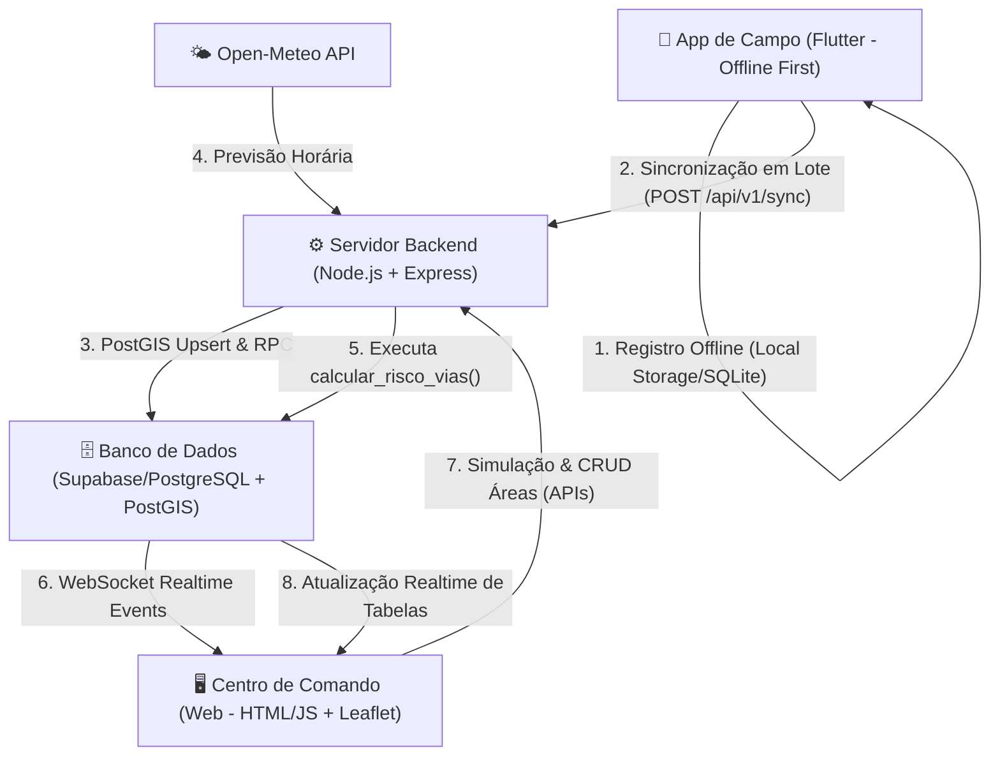

# 🚜🌧️ TrafegoAlert — Plataforma Preditiva de Trafegabilidade (Ariquemes/RO)

**Inteligência de Dados para Prevenção de Bloqueios em Estradas Vicinais**

O **TrafegoAlert** é uma solução completa projetada para garantir o escoamento logístico da produção agropecuária e de piscicultura em Ariquemes/RO durante o inverno amazônico. A plataforma transforma a gestão de infraestrutura de reativa para proativa: ao invés de agir apenas após o atolamento de caminhões, o sistema prevê pontos de colapso logístico cruzando dados meteorológicos em tempo real com históricos de vulnerabilidade das vias, permitindo manutenção preventiva e rotas alternativas seguras para produtores, transportadores e ônibus escolares.

---

## 👥 Identificação da Equipe
* **Desenvolvedor & Líder de Projeto:** Irineu Bruno (GitHub: [@irineubruno](https://github.com/irineubruno))
* **Instituição:** Instituto Federal de Educação, Ciência e Tecnologia de Rondônia (IFRO)

## 🎯 Categoria e Proponente
* **Desafio:** Categoria Otimização Logística / Infraestrutura Rural
* **Proponente:** QUANYX TECNOLOGIA

---

## 🌐 Links do MVP (Online e Acessível)
O sistema está em produção e possui os seguintes acessos:

**Centro de Comando Web (Gestão):**
👉 **[https://trafegoalerta.bisn.com.br/](https://trafegoalerta.bisn.com.br/)**
* **Acesso Simplificado:** Não requer credenciais de login para a visualização geral do painel, garantindo que a banca possa testar toda a interface imediatamente sem barreiras.
* **Painel de Relatórios:** Disponível na rota amigável `/lista` ou pelo botão "Ver Relatórios" no dashboard.

**Aplicativo Mobile (Acesso e Download):**
👉 **[Versão Web App: https://app-trafegoalerta.bisn.com.br/](https://app-trafegoalerta.bisn.com.br/)**
👉 **[Download do APK Android](./app-release.apk)** (Baixe e instale no seu celular Android)

---

## 🎥 Pitch e Apresentação
* **Slides da Apresentação:** [🔗 Visualizar Apresentação de Slides (Google Slides/Canva)](#) *(Insira o link final aqui)*
* **Vídeo do Pitch (YouTube):** [🔗 Assistir Vídeo de Demonstração (Pitch de 3 minutos)](#) *(Insira o link final aqui)*

---

## 🚜 Descrição do Problema

Durante o inverno amazônico, a região de Ariquemes/RO enfrenta chuvas torrenciais que inviabilizam o tráfego nas estradas rurais vicinais (como a Linha C-65, C-70 e travessões). Os impactos diretos incluem:
1. **Perda de Produção:** Leite, grãos, gado e peixes não conseguem ser escoados, gerando prejuízos financeiros aos produtores rurais.
2. **Isolamento de Comunidades:** Estudantes perdem aulas devido à intransitabilidade do ônibus escolar e serviços de emergência (ambulâncias) não chegam aos locais.
3. **Desperdício de Recursos Públicos:** A Secretaria de Obras atua de forma reativa, apagando incêndios logísticos e gastando recursos sem planejamento.

---

## 💡 Descrição da Solução Desenvolvida

O **TrafegoAlert** soluciona o problema através de uma arquitetura integrada e de processamento de dados geográficos em tempo real:

1. **Centro de Comando Web (Gestão):** Dashboard interativo em *Glassmorphism Dark Mode* para a Secretaria de Obras. Permite visualizar a malha viária colorida dinamicamente pelo nível de risco, simular cenários de chuva e resolver incidentes de campo.
2. **Aplicativo de Campo (Coleta Offline-First):** Aplicativo Flutter executado pelos produtores e caminhoneiros. Permite gravar rotas e reportar atolamentos, quedas de árvores ou pontes caídas mesmo sem internet. Os dados ficam salvos localmente e sincronizam automaticamente ao detectar sinal.
3. **Motor Preditivo (Inteligência Climática):** Serviço em Node.js que consome previsões de chuva da API do **Open-Meteo** para o município de Ariquemes e executa um algoritmo espacial (stored procedures em PostgreSQL com PostGIS) para estimar o risco de bloqueio das vias vicinais.

---

## 🏗️ Arquitetura e Fluxo de Dados

O ecossistema é descentralizado para tolerar falhas de rede no campo e garantir sincronização em milissegundos na cidade:

---

## 🛠️ Tecnologias Utilizadas

### 🗄️ Banco de Dados & BaaS (Supabase)
* **PostgreSQL:** Banco relacional hiper-robusto.
* **PostGIS:** Extensão oficial usada para armazenar objetos espaciais (`LineString` para vias, `Point` para incidentes, `Polygon` para áreas de risco) e efetuar consultas espaciais rápidas.
* **Supabase Realtime (WebSockets):** Atualização instantânea do mapa da prefeitura assim que novos dados chegam do campo.

### ⚙️ Backend (Node.js & Express)
* **Express.js:** Framework de APIs rápido e leve.
* **Node-Cron:** Agendador de tarefas periódicas para execução do motor climático.
* **Axios & PG:** Consumo de APIs climáticas e integração de alto desempenho com o banco.

### 🖥️ Centro de Comando (Dashboard Web)
* **HTML5 & Vanilla CSS3:** Visualização limpa e com excelente performance, usando padrões modernos de *Glassmorphic design* e variáveis responsivas para Dark Mode.
* **Vanilla Javascript:** Lógica rápida livre de frameworks pesados, garantindo compatibilidade com computadores antigos da prefeitura.
* **Leaflet.js:** Biblioteca open-source leve para plotagem cartográfica interativa.

### 📱 Aplicativo Mobile (Flutter & Dart)
* **Flutter Map:** Componente canvas de alta performance para desenhar mapas rurais offline de forma nativa na GPU.
* **SQFlite & SharedPreferences:** Estrutura de persistência local para fila de eventos offline.
* **Connectivity Plus:** Monitoramento dinâmico da conexão para sincronização inteligente background.

---

## 🕹️ Instruções de Uso e Teste do MVP

A banca pode validar o MVP em menos de 5 minutos seguindo estes passos simples diretamente no navegador:

### 1. Centro de Comando Web
1. Acesse o MVP em: [https://trafegoalerta.bisn.com.br/](https://trafegoalerta.bisn.com.br/).
2. **Navegue no Mapa:** Observe as linhas que representam a malha de estradas vicinais de Ariquemes (coloridas em Verde = Livre, Amarelo = Atenção, Vermelho = Bloqueado).
3. **Simule a Precipitação Climática:** No painel superior esquerdo (Simulador Climático), mova o slider de chuva de `0 mm` para `25 mm` e clique em **"Recalcular Risco"**. O backend processará os novos dados e o mapa atualizará as cores das estradas em tempo real.
4. **Analise Rotas:** Clique em dois pontos distantes das linhas no mapa para traçar uma rota. O sistema mostrará a rota sugerida no mapa e calculará o nível de risco acumulado com base no clima e incidentes da via.
5. **Desenhe Áreas de Alerta:** Use o painel de desenho (Leaflet Geoman) no mapa para desenhar um polígono customizado em cima de alguma via. Ao fechar o desenho, um formulário flutuante solicitará o nome, descrição e severidade da área (ex: "Alerta Crítico C-65 Sul"), inserindo os dados dinamicamente no mapa.
6. **Resolva um Incidente:** Clique em algum ícone de incidente (ex: atolamento) no mapa, leia a descrição e clique em **"Marcar como Resolvido"** para removê-lo e restaurar o fluxo regular da via.

### 2. Painel de Relatórios (`/lista`)
1. Clique no botão **"Ver Relatórios"** ou acesse: [https://trafegoalerta.bisn.com.br/lista](https://trafegoalerta.bisn.com.br/lista).
2. Use os campos de busca e filtros dinâmicos por gravidade, tipo de pavimento (asfalto/terra) ou status de resolução.
3. Clique em **"Exportar CSV"** para obter uma planilha formatada em UTF-8 com os registros filtrados em tempo real.
4. Clique em **"Ver no Mapa"** em qualquer linha para ser redirecionado e focado nas coordenadas exatas da ocorrência no mapa principal.

### 3. Aplicativo Móvel (Acesso Web e APK)
Para testar a experiência do aplicativo que vai para o campo, você possui duas opções:

**Opção A - Via Web App (Sem instalação):**
1. Acesse o Web App pelo navegador do seu celular ou computador: [https://app-trafegoalerta.bisn.com.br/](https://app-trafegoalerta.bisn.com.br/).
2. A interface simula o aplicativo nativo e permite registrar ocorrências.

**Opção B - Instalando o APK Android (Nativo):**
1. Baixe o arquivo **[app-release.apk](./app-release.apk)** que está na raiz deste repositório.
2. Transfira para o seu dispositivo Android e execute a instalação (pode ser necessário autorizar "Instalar de fontes desconhecidas").
3. Abra o app "TrafegoAlerta", registre novos alertas e grave rotas no mapa. 
4. Para testar o modo **Offline-First**, coloque o aparelho em modo avião, faça o registro do alerta (será exibido um contador de eventos pendentes na barra laranja superior) e desligue o modo avião para ver a sincronização automática acontecer no banco de dados.

---

## 🤖 Declaração de Uso de IA

* **Ferramentas utilizadas:** Gemini (Google DeepMind) e ChatGPT.
* **Finalidade:** Apoio na organização estrutural da documentação, geração de scripts de limpeza e conversão de dados espaciais (GeoJSON para WKT PostgreSQL), depuração de problemas de rede WebSocket/CORS no ambiente Docker e refinamento estético do layout em Glassmorphism.
* **Partes do projeto apoiadas por IA:** Código de migrações espaciais PostGIS, design e estruturação de templates CSS do dashboard web, script de mock de dados geográficos iniciais (`update_linhas.js`) e mapeamento do serviço offline-first do Flutter.
* **O que a equipe revisou, adaptou ou validou:** A equipe revisou todos os fluxos de consulta geográfica gerados, adaptou as rotas das APIs do Node.js para garantir proteção contra SQL Injection e validou o funcionamento prático da sincronização do aplicativo em campo físico real com sinal simulado de baixa qualidade.

---

## 🔬 Evidências de Validação e Testes

Para garantir a confiabilidade da plataforma no mundo real, realizamos os seguintes testes de estresse e de campo:
* **Validação Cartográfica:** Importação bem-sucedida de dados de mapeamento do CENSIPAM/SIPAM de 2019 e cruzamento automático com malhas recentes do OpenStreetMap para Ariquemes/RO.
* **Teste Offline e Resiliência:** Validação do banco `sqflite` móvel simulando falha total de rede 4G durante o percurso em uma estrada vicinal secundária, com envio dos pacotes JSON corretos sem perda de pontos ao reconectar na cidade.
* **Cálculo da Matriz de Risco:** Testes de estresse da Stored Procedure `calcular_risco_vias` com volumes de chuva simulados variando de `0` a `50 mm`, conferindo a correta propagação do status de bloqueio com base nos multiplicadores de veículos (como ônibus escolar e caminhão pesado).
* **Logs Limpos:** O backend conta com controle CORS e monitoramento contínuo de erros (`/health`), rodando em ambiente conteinerizado isolado em porta segura.

---

*TrafegoAlert — Construindo caminhos mais seguros e conectados para o desenvolvimento rural de Rondônia.*
